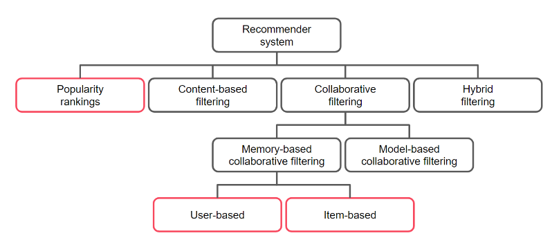

# ML_RecommederSys
Purpose : reduce the user’s search effort and increase customer satisfaction by showing the most beneficial products.
“liquid” product: they have many shapes and escape one-size-fits-all solutions

## Aspects affects Recommender

### Domain
what are you recommending ?Movies, playlists, jobs, cars, groceries, holidays,..
1. How bad it would be to be wrong?
recommend the wrong movie vs  recommend the wrong foster parents to children in need
2. whether you can recommend the same thing more than once or not
watch movies once vs buy cookies multiple times

### Purpose
1. specific metrics to measure the accomplishment of the recommender purpose (success by clicks on the recommended movies… or by viewing time.)
2. business strategy: promote the movies the company produced itself versus movies it has to pay a license for.

Hint : data scientist needs to make sure the goal of the recommender is well defined and can be measured before diving into complex technical implementations.

### Trustworthiness
ask yourself: does the end user trust the recommendations, or considers them attempts at manipulation?
trade-offs between achieving some business-goals and building trust

### Recommendation source
Who provides the recommendations?
    - expert recommendations” based on the domain knowledge
    - trusting the “opinions of the masses”

### Input & Output
collect input from users:
     - explicit in the form of ratings : somehow annoying for user
     - implicit by deducing what a customer behaviour (what they bought, how long they watched a movie, where they clicked, etc.)
white box recommenders explain where the recommendations come from, such as “because you bought…”
black box recommenders don’t explain.
trade-off between building trust with the user and not scaring them away.

## Types

### User Based Recommender
Provides  Serendipity (is an item that you may like but is a surprise, something a little outside of your normal purview)
